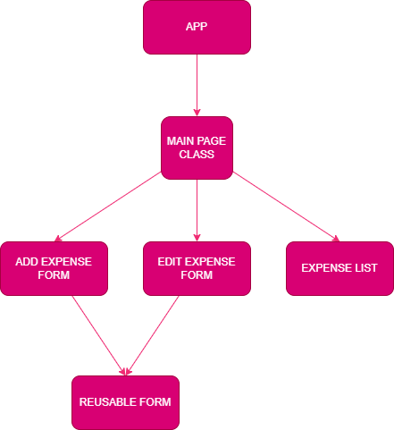

# Expense Tracker

A simple app for tracking expenses

## How to run the app

1. Clone this repository.
2. Navigate to the folder where the repo is cloned, and open week1/expense-tracker folder. i.e

   `cd week1/expense-tracker`

3. Run the following commands

```bash
1. npm install
2. npm start
```

This runs the app in the development mode.\
Open [http://localhost:3000/miniapps-silver](http://localhost:3000/miniapps-silver) to view it in your browser.

Aleternatively, open [https://mwiberisu.github.io/miniapps-silver/](https://mwiberisu.github.io/miniapps-silver/) for a working version

## Component Tree



## Author

[github/Mwiberisu](https://github.com/Mwiberisu)

## License

[MIT](https://choosealicense.com/licenses/mit/)

## Copyright

Copyright © 2024, [Susan Mwiberi](https://github.com/Mwiberisu).
