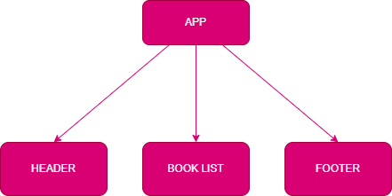

# Expense Tracker

A simple Book Store app that uses redux for state management

## How to run the app

1. Clone this repository.
2. Navigate to the folder where the repo is cloned, and open week2/book-store folder. i.e

   `cd week2/book-store`

3. Run the following commands

```bash
1. npm install
2. npm start
```

This runs the app in the development mode.\
Open [http://localhost:3000/miniapps-silver/bookstore](http://localhost:3000/miniapps-silver/bookstore) to view it in your browser.

Alternatively, open [https://mwiberisu.github.io/miniapps-silver/bookstore/](https://mwiberisu.github.io/miniapps-silver/bookstore/) for a working version

## How to deploy the app

1. Clone this repository.
2. Navigate to the folder where the repo is cloned, and open week2/book-store folder. i.e

   `cd week2/book-store`

3. Run the following commands
   Create a folder for storing book-store app build

   `mkdir -p newbuild/bookstore`

   Run below deploy command, which will push the build folder to gh-pages branch on github

   `npm run deploy -- -m "Deploy book store"`

## Component Tree



## Author

[github/Mwiberisu](https://github.com/Mwiberisu)

## License

[MIT](https://choosealicense.com/licenses/mit/)

## Copyright

Copyright © 2024, [Susan Mwiberi](https://github.com/Mwiberisu).
